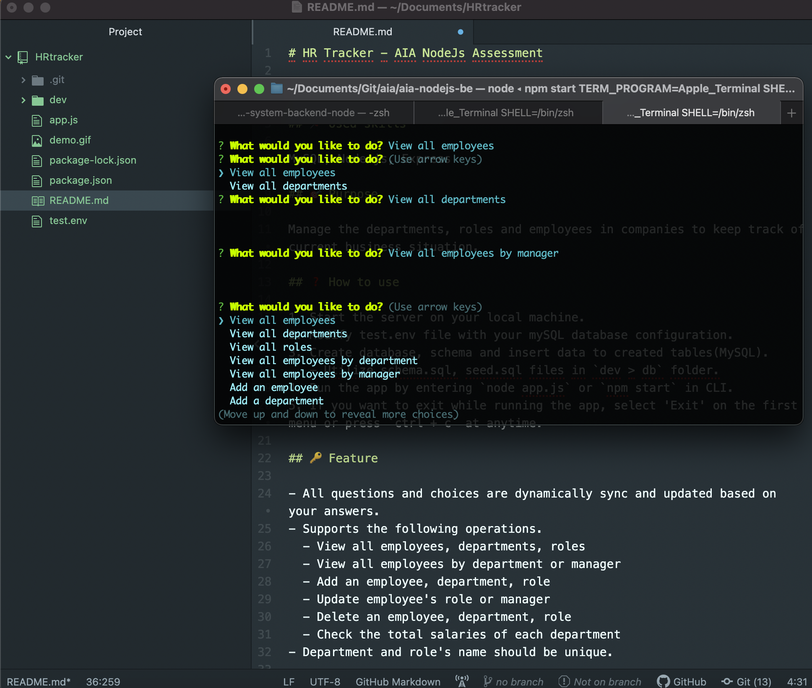

# HR Tracker - AIA NodeJs Assessment for Aidy

> CMS(Content Management System) for Human Resource

## Used skills

MySQL, Node.js, Express

## Purpose

Manage the departments, roles and employees in companies to keep track of current business situation.

## How to use

1. Start the server on your local machine.
2. Modify test.env file with your mySQL database configuration.
3. Create database, schema and insert data to created tables(MySQL).
   - Utilize schema.sql, seed.sql files in `dev > db` folder.
4. Run the app by entering `node app.js` or `npm start` in CLI.
5. If you want to exit while running the app, select 'Exit' on the first menu or press `ctrl + c` at anytime.

## Feature

- All questions and choices are dynamically sync and updated based on your answers.
- Supports the following operations.
  - View all employees, departments, roles
  - View all employees by department or manager
  - Add an employee, department, role
  - Update employee's role or manager
  - Delete an employee, department, role
  - Check the total salaries of each department
- Department and role's name should be unique.

## Limitation

You can insert multiple employees having the same full name but it's not recommended. This app's database is structured by utilizing mostly names not unique keys. So duplicated names may cause an error or unintended consequences when manipulating their data.

## Screenshot.

